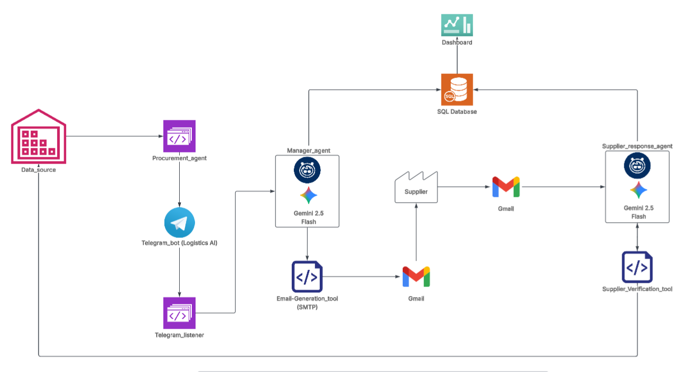

# ✈️ AI Procurement Agent for Airline Supply Chain Management

An AI-powered, human-in-the-loop procurement system for airline spare parts management. The system continuously monitors inventory levels, identifies procurement risks, enables manager approvals through Telegram, uses Gemini to interpret natural-language procurement instructions and supplier responses, automatically generates and sends standardized purchase order emails, and updates a real-time procurement dashboard.

## 🏗️ System Architecture



---

## 📖 Project Overview

This project presents an AI-powered Procurement Agent designed to support procurement workflows in logistics-intensive industries, particularly small and medium-sized organizations that may not have access to enterprise procurement platforms such as SAP.

Rather than replacing existing procurement systems, the objective is to develop an intelligent assistant that integrates with existing business processes, automates repetitive procurement tasks, and supports procurement managers in making faster and more informed decisions while keeping humans in control of all final procurement actions.

The solution follows a **Human-in-the-Loop (HITL)** architecture, where AI is applied only to tasks that require reasoning and natural-language understanding, while deterministic business operations remain rule-based for reliability and auditability. The system continuously monitors inventory levels, evaluates procurement risks, recommends replenishment quantities, interprets manager instructions written in natural language, processes supplier responses received via email, and maintains an up-to-date procurement dashboard. Procurement managers retain full authority to approve, reject, or modify every purchase request before an order is issued.

In a production environment, the same architecture could integrate directly with ERP systems, relational databases, warehouse management systems, or external APIs, allowing procurement monitoring to execute automatically through scheduled jobs or event-driven workflows. For demonstration purposes, the current implementation is initiated manually using command-based execution.

To improve reliability, reduce inference costs, and eliminate the possibility of hallucinated procurement information, purchase-order emails are generated using deterministic templates, while Gemini is reserved for tasks requiring reasoning and natural-language understanding.

To demonstrate the concept, the project uses a fictional **Airline Supply Chain Management** company as a case study. The aviation industry provides a realistic scenario because aircraft maintenance depends on the timely availability of critical spare parts, strict operational requirements, multiple suppliers, and time-sensitive procurement decisions.

Due to limited infrastructure and the scope of the prototype, the system operates on a static dataset that simulates an enterprise inventory database containing:

- **22 aircraft spare parts**
- **6 approved suppliers**
- **Business-specific stock levels and reorder thresholds**

**📌 Problem Statement**

Airline maintenance operations depend on the timely availability of critical spare parts. Traditional procurement processes are often manual, fragmented, and slow, resulting in delayed purchasing decisions, limited visibility, and increased operational risk. These inefficiencies can contribute to costly **Aircraft on Ground (AOG)** situations when critical components are unavailable.


This project introduces an **AI-powered, Human-in-the-Loop Procurement Agent** that combines business automation with intelligent decision support while ensuring managers retain full control over procurement decisions.

The system:

- Continuously monitors inventory levels for low-stock items
- Evaluates procurement risk using business-specific rules
- Notifies procurement managers through Telegram
- Supports Human-in-the-Loop (HITL) approval workflows
- Uses Gemini to interpret natural-language manager instructions
- Dynamically adjusts order quantities based on manager intent
- Automatically generates standardized purchase-order emails
- Sends purchase orders through Gmail using SMTP
- When supplier sends the order confirmation.
- Reads supplier responses from Gmail using IMAP
- Uses Gemini to extract supplier decisions and expected delivery dates
- Updates a centralized SQLite database
- Provides real-time procurement monitoring through an interactive Streamlit dashboard

---
## ✨ Key Features

### 📦 Inventory Monitoring

- Automatically detects low-stock aircraft spare parts
- Generates business-specific reorder recommendations
- Monitors inventory against configurable reorder thresholds

---

### ⚠️ Risk Assessment

- Business-aware procurement risk evaluation
- High, Medium, and Low risk classification
- Prioritizes critical aviation components

---

### 👨‍💼 Human-in-the-Loop Procurement

- Telegram-based procurement approval workflow
- Managers can approve, reject, or modify purchase requests
- Ensures all procurement decisions remain under human control

---

### 🧠 AI Manager Interpretation

Procurement managers can provide natural-language instructions such as:

- Add 10 more units
- Double the quantity
- Make it urgent
- Set quantity to 25 units

Gemini interprets these instructions and determines the final procurement quantity and priority before the purchase order is generated.

---

### 📧 Automated Purchase Order Generation

- Standardized purchase-order generation
- Dynamic quantity adjustment based on manager decisions
- Automatic email delivery using Gmail SMTP
- Purchase Order ID tracking for supplier communication

---

### 📬 AI Supplier Response Processing

- Reads supplier emails using Gmail IMAP
- Uses Gemini to interpret supplier responses
- Extracts supplier acceptance status
- Identifies expected delivery dates
- Updates the procurement database automatically

---

### 📊 Interactive Procurement Dashboard

The interactive Streamlit dashboard provides:

- 📦 Procurement KPI cards
- 📋 Procurement request overview
- 📦 Current stock and ordered quantity tracking
- 🏭 Supplier status and expected delivery date tracking
- ⚠️ Risk level monitoring and distribution analytics
- 📊 Supplier and procurement status distribution charts
- 📈 Procurement timeline visualization
- 🔍 Search and filtering by part, supplier, status, and risk level
- 📄 Detailed procurement request view
- 📥 CSV report export
- 🖨️ Dashboard printing
- 📧 One-click supplier response processing

---

## 🛠️ Technology Stack

| Category | Technology |
|-----------|------------|
| Programming Language | Python 3.13 |
| AI Models | Google Gemini 2.5 Flash |
| Database | SQLite |
| Dashboard | Streamlit |
| Data Visualization | Plotly |
| Data Processing | Pandas |
| Messaging | Telegram Bot API |
| Email Delivery | Gmail SMTP |
| Email Processing | Gmail IMAP |
| Environment Management | uv |

---

## 📂 Project Structure

```text
Procurement-agent/
│
├── data/
│   ├── airline_inventory_parts.csv
│   ├── airline_suppliers_list.csv
│   └── procurement.db
│
├── src/
│   ├── procurement_agent.py          # Main procurement workflow
│   ├── telegram_listener.py          # Human-in-the-Loop approval workflow
│   ├── notification_tool.py          # Telegram notifications
│   ├── manager_agent.py              # Gemini manager instruction interpreter
│   ├── email_tool.py                 # Purchase order generation
│   ├── gmail_tool.py                 # Gmail SMTP integration
│   ├── check_supplier_emails.py      # Reads supplier emails (IMAP)
│   ├── supplier_response_agent.py    # Gemini supplier response interpreter
│   ├── supplier_tool.py              # Supplier lookup utilities
│   ├── inventory_tool.py             # Inventory operations
│   ├── order_manager.py              # Order recommendation logic
│   ├── risk_utils.py                 # Risk assessment
│   ├── request_store.py              # SQLite CRUD operations
│   ├── database.py                   # Database initialization
│   ├── user_state.py                 # Telegram conversation state
│   └── models.py                     # Procurement request model
│
├── dashboard.py                      # Streamlit dashboard
├── requirements.txt
├── .env.example
└── README.md
```
---

## 🛠️ Agent Tools

The AI agents interact with the environment through a collection of specialized tools. Each tool is responsible for a single business function, allowing the agents to orchestrate procurement workflows while keeping the implementation modular and maintainable.

| Tool | Purpose |
|------|---------|
| Inventory Tool | Retrieves inventory data and identifies low-stock parts |
| Supplier Tool | Retrieves supplier information and validates approved supplier emails |
| Order Manager | Calculates recommended reorder quantities |
| Notification Tool | Sends procurement approval requests through Telegram |
| Gmail Tool | Sends purchase-order emails via Gmail SMTP |
| Supplier Response Tool | Reads supplier responses from Gmail using IMAP |
| Request Store | Persists procurement requests and updates in SQLite |

---

## Security

Sensitive credentials are managed using environment variables stored in a local `.env` file.

The project never stores API keys or email credentials in source code or version control.

Supplier emails are validated against an approved supplier list before AI processing to prevent unrelated emails from being interpreted as procurement responses.

---

## Deployment

The project is designed to run locally using Python and uv.

Future deployments could package the application using Docker and deploy it on cloud platforms such as Azure, AWS, or Google Cloud.

---

## ⚙️ Installation

Clone the repository:

```bash
git clone https://github.com/SaiSwaroop-Gali/Procurement-agent
cd Procurement-agent
```

Create a virtual environment:

```bash
uv venv
```

Activate the environment:

### Windows

```powershell
.venv\Scripts\activate
```

### Linux / Mac

```bash
source .venv/bin/activate
```

Install dependencies:

```bash
uv pip install -r requirements.txt
```

---
---

## 📋 Prerequisites

Before running the project, make sure you have:

- Python 3.13 or later
- A Google Gemini API key
- A Telegram Bot
- A Telegram Chat ID
- A Gmail account with 2-Step Verification enabled
- A Gmail App Password
- IMAP enabled for your Gmail account

---

## ⚙️ Service Configuration

### 🤖 Google Gemini

1. Create a Gemini API key from **Google AI Studio**.
2. Copy the API key.
3. Add it to your `.env` file:

```env
GEMINI_API_KEY=your_api_key
```

---

### 💬 Telegram Bot

1. Open Telegram and search for **@BotFather**.
2. Create a new bot using the `/newbot` command.
3. Copy the generated Bot Token.
4. Start a conversation with your bot.
5. Obtain your Telegram Chat ID.
6. Add both values to your `.env` file.

```env
TELEGRAM_BOT_TOKEN=your_bot_token
TELEGRAM_CHAT_ID=your_chat_id
```

---

### 📧 Gmail

The system uses Gmail for:

- Sending purchase-order emails (SMTP)
- Reading supplier responses (IMAP)

Setup steps:

1. Enable **2-Step Verification** on your Google account.
2. Generate a **Google App Password**.
3. Enable **IMAP** in Gmail Settings.
4. Configure the following variables:

```env
EMAIL_ADDRESS=your_email@gmail.com
EMAIL_APP_PASSWORD=your_gmail_app_password
```

> **Note:** Never use your Gmail account password. Always use a Google App Password.

---

## 🔐 Environment Variables

Create a `.env` file:

```env
GEMINI_API_KEY=your_api_key

TELEGRAM_BOT_TOKEN=your_bot_token
TELEGRAM_CHAT_ID=your_chat_id

EMAIL_ADDRESS=your_email@gmail.com
EMAIL_APP_PASSWORD=your_app_password
```

---

## ▶️ Running the System

### ⚠️ Important

## ⚠️ Important

This prototype uses a static CSV dataset to **mimic real-time inventory updates**.

To simulate a low-stock event:

1. Open `data/airline_inventory_parts.csv`.
2. Set the **`reorder_threshold`** higher than the corresponding **`current_stock`** value for the part you want to test.
3. Save the file.
4. Run the Procurement Agent.

The agent will interpret this change as inventory dropping below the reorder threshold and automatically generate a procurement request, mimicking how a production system would respond to real-time inventory updates from an ERP or warehouse database.

### Start the Telegram Listener

```bash
uv run python src/telegram_listener.py
```

### Generate Procurement Requests

```bash
uv run python src/procurement_agent.py
```

### Launch the Dashboard

```bash
uv run streamlit run dashboard.py
```
### Process Supplier Responses

Supplier responses can be processed directly from the dashboard using the
📧 Check Supplier Responses button.

Alternatively:

```bash

uv run python src/check_supplier_emails.py

```
---

## 🧪 Example Manager Instructions

The AI Manager Agent understands natural language commands such as:

```text
Add 10 more units

Double the quantity

Make it urgent

Set quantity to 25

Add another 5 units for next month's maintenance

Order 15 more and mark as highest priority

```
---
## 🚀 Future Improvements

Potential enhancements for future versions of the project include:

- 🐳 Containerized deployment using Docker
- ☁️ Cloud deployment on Azure, AWS, or Google Cloud
- 🔐 User authentication and role-based access control
- 👥 Multi-user procurement approval workflows
- 📈 Supplier performance analytics and vendor scoring
- 🔄 Integration with ERP systems (e.g., SAP, Microsoft Dynamics, Oracle)
- 📡 Event-driven procurement using real-time inventory updates
- 📱 Multi-channel notifications (Microsoft Teams, Slack, WhatsApp)
- 📊 Predictive inventory forecasting using historical procurement data

---

## 📜 License

This project is developed for educational, research, and demonstration purposes.

---

## 👨‍💻 Author

Sai Swaroop Gali
